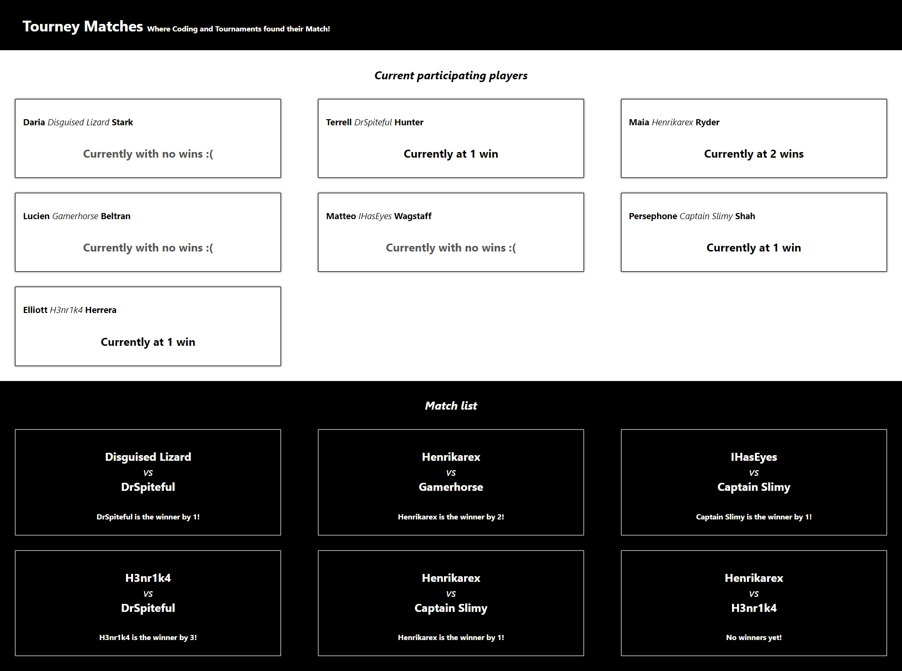

## **Tourney Matches** project.
---
This project is a part of [Lighthouse labs.](https://www.lighthouselabs.ca/) educational program and was created only in educational purposes.

The project serves as an introduction to [React](https://react.dev/) and is centered around managing small tournaments, such as Super Smash Bros.

In this project, we had only one state for our app since the data was static (i.e. no way for a user to change the data).

### Goal
The main focus of this project is to practice passing down props to children elements, get a better understanding of ```props.children```, and practice playing with data structures.

### Project view

___


This project was bootstrapped with [Create React App](https://github.com/facebook/create-react-app).

### Available Scripts

In the project directory, you can run:

### `npm start`

Runs the app in the development mode.\
Open [http://localhost:3000](http://localhost:3000) to view it in your browser.

The page will reload when you make changes.\
You may also see any lint errors in the console.

